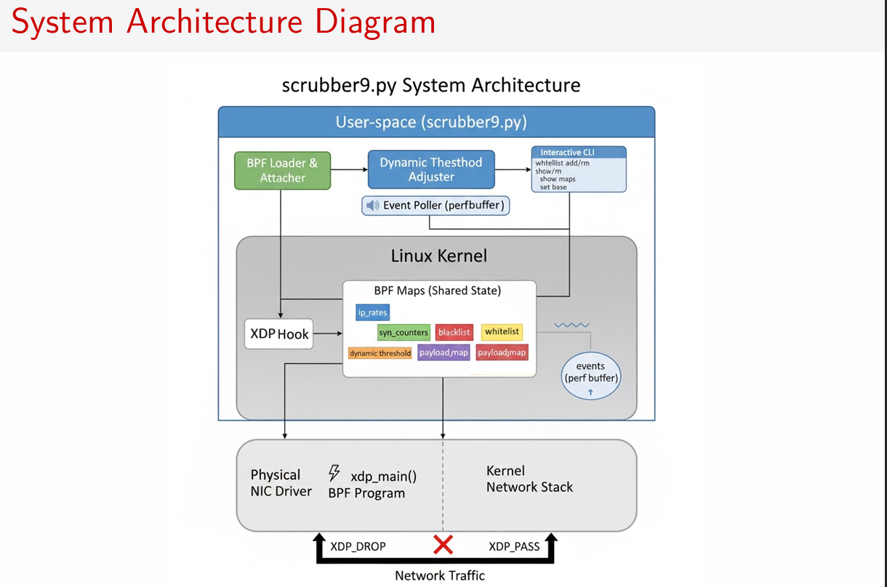
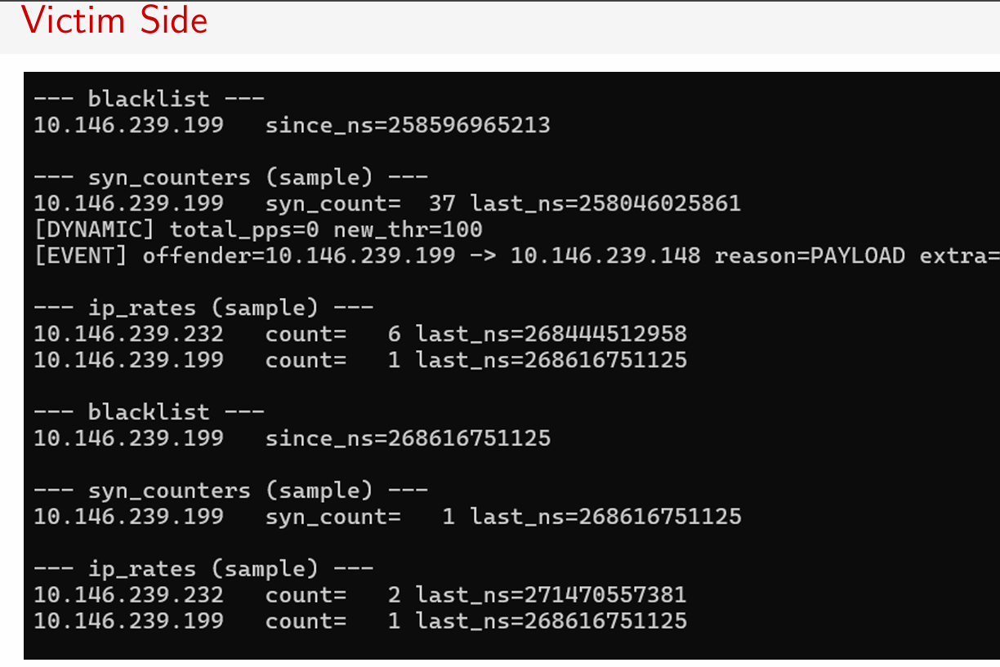
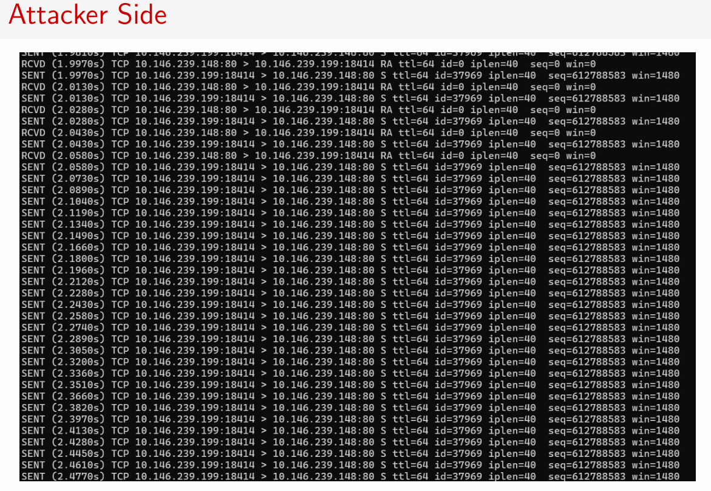
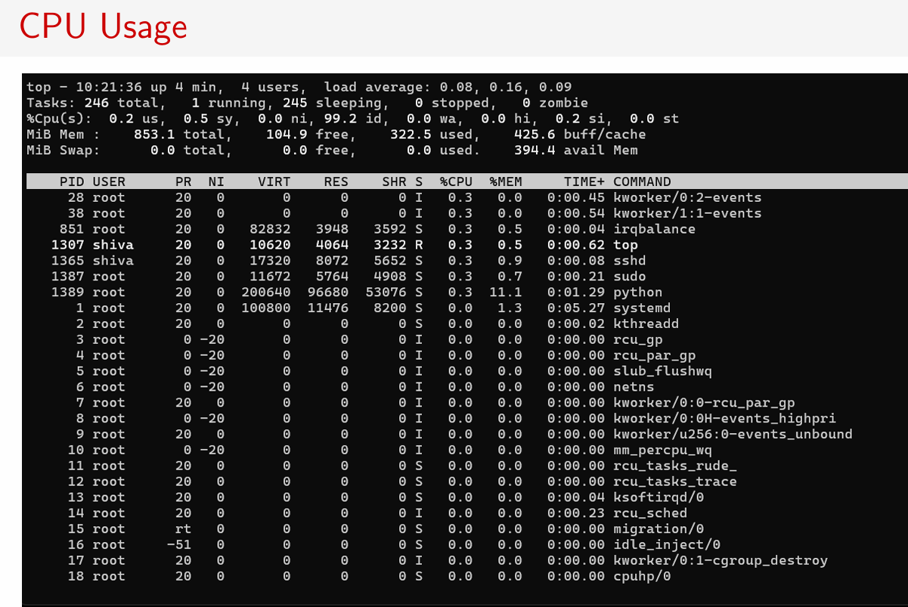

# In-Kernel Advanced XDP eBPF DDoS Scrubber

## System Architecture



## Results – Qualitative

### Observations:
- **Real-time Monitoring**: The user-space script provides immediate, live feedback when an IP is banned. The log clearly states the offending IP and the reason for the ban (e.g., RATE, SYN, or PAYLOAD).
- **Effective Detection**: The multi-signal logic works. Generic UDP floods trigger "RATE", while nping --syn floods correctly trigger "SYN".
- **Dynamic Adaptation**: The [DYNAMIC] log entries show the script automatically raising the PPS threshold in response to high total traffic, and lowering it when traffic subsides.
- **Low CPU Overhead**: During a high-volume (e.g., 500k PPS) flood, top confirms the Python script uses negligible CPU, and kernel CPU load remains low, as packets are efficiently dropped at the driver.





## Results – Comparison

**Baseline (iptables):**
- Hook: Netfilter (IP layer).
- Process: Packets must be allocated into kernel memory (SKB) before being dropped.
- Performance: CPU-intensive. Becomes a bottleneck at high packet rates (e.g., 1-2 Mpps).

**Proposed (XDP):**
- Hook: NIC Driver (earliest point).
- Process: Operates directly on packet metadata. No SKB is allocated for dropped packets.
- Performance: Extremely fast (10s of Mpps). CPU load is minimal.

### Table: Conceptual Performance Comparison

| Metric | Baseline (iptables) | Proposed (XDP) |
|--------|---------------------|----------------|
| Max PPS Handled | Low ( 1-2 Mpps) | Very High (10-40+ Mpps) |
| CPU % (under flood) | High | Very Low |
| Latency (passed packets) | Higher | Lowest |
| Point of Drop | Network Stack | Network Driver |

## Results – Quantitative

**Performance Metrics (System-Dependent):**
- Maximum Dropped PPS (Flood): 0.05 Mpps
- CPU Utilization (Python Script): less than 1%
- CPU Utilization (Kernel) @ 1 Mpps flood: less than 1%

**BPF Map Utilization (During Flood):**
- ip rates entries: 1 / 16384
- blacklist entries: 1 / 1024

## Usage & Configuration

### Execution:
```bash
chmod +x scrubber9.py
sudo ./scrubber9.py [interface] (e.g., ens33)
```

### Logging to a File (Unbuffered):
Run in background with unbuffered Python output:
```bash
sudo python3 -u ./scrubber9.py > scrubber.log 2>&1 &
```

Monitor the log file in real-time:
```bash
tail -f scrubber.log
```

### Interactive CLI Commands:
- `whitelist add <ip>`: Adds an IP to the bypass list.
- `whitelist rm <ip>`: Removes an IP from the bypass list.
- `show maps`: Prints the current number of entries in all maps.
- `set base <n>`: Manually changes the base PPS threshold.
- `quit` or `exit`: Detaches the XDP program and exits.

## Conclusion

### Contributions:
- A functional, high-performance DoS mitigation tool using XDP, capable of dropping packets at line-rate.
- A multi-signal detection system (generic rate, SYN-specific, and payload-specific) for more accurate, intelligent banning.
- A dynamic threshold system that automatically adapts the scrubber's aggression based on total server traffic.
- A fully interactive user-space control script for real-time monitoring and administration.

### Limitations & Out of Scope:
- **IPv4-only**: The current packet parser does not support IPv6.
- **Stateless**: This is not a stateful firewall; it does not track full TCP connections, only the initial SYN.
- **Not an IPS/WAF**: It does not perform Deep Packet Inspection (DPI) for complex application-layer attacks (e.g., SQL injection).

## Future Work

- Add IPv6 parsing logic and IPv6-capable BPF maps.
- Load/save configuration (whitelist, thresholds) from a .conf file.
- Implement more advanced protocol validators (e.g., for DNS, NTP) to detect reflection/amplification attacks.

## References

- BPF Community. (2025). BPF Compiler Collection (BCC). https://github.com/iovisor/bcc
- Linux Kernel Documentation. (2025). BPF and XDP Reference Guide. https://www.kernel.org/doc/html/latest/bpf/
- Cloudflare. (2019). XDP in practice: integrating XDP in our DDoS mitigation pipeline. https://blog.cloudflare.com/xdp-in-practice/
- T. Herbert, S. P. T. (2017). XDP: The eXpress Data Path. https://lwn.net/Articles/750641/
- N. A. M. Glebov. (2025). Fowler–Noll–Vo hash function (FNV-1a). IETF.

